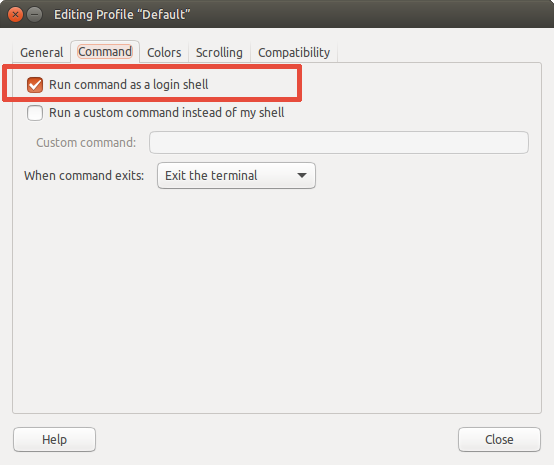

RVM package for Ubuntu
===

[RVM](http://rvm.io/) is a command-line tool which allows you to easily install, manage, and work with multiple ruby environments from interpreters to sets of gems.

This package installs rvm with some defaults:
- stable rvm is used;
- rvm is installed using `mixed-mode` install: usable by all users on the system, with isolated rubies/gemsets in user's $HOME (see more [here](http://rvm.io/rvm/install#installation-explained));
- rvm is installed into `/usr/share/rvm` (as Debian/Ubuntu convention);
- all sudoers are automatic added to `rvm` group at install;
- all sudoers get local gemsets enabled;

Additionally automatic updates are provided by a Ubuntu PPA.

# Install

## 1. Add the PPA and install the package

Open a terminal (`Ctrl+Alt+T`) and run:

```term
sudo apt-add-repository -y ppa:rael-gc/rvm
sudo apt-get update
sudo apt-get install rvm
```

NOTE: if `apt-add-repository` is not present on your Ubuntu you can get it via `apt-get install software-properties-common`.

## 2. Change your terminal window

Now, in order to always load rvm, change the Gnome Terminal to always perform a login.

At terminal window, click `Edit` > `Profile Preferences`, click on `Title and Command` tab and check `Run command as login shell`.



## 3. Logout and login

A lot of changes were made (scripts that needs to be reloaded, you're now member of `rvm` group) and in order to properly get all them working, you need to login and logout. This requires not only close terminal, but really logout and login again.

## 4. Install a ruby

Now you're ready to install rubies. Open a terminal (`Ctrl+Alt+T`) and run:

```term
rvm install ruby
```
# RVM Usage

RVM complete instructions are available at RVM repository: https://github.com/rvm/rvm

Additionally you can check manual pages too: open a Terminal (`Ctrl+Alt+T`) and run:

```term
man rvm
```
